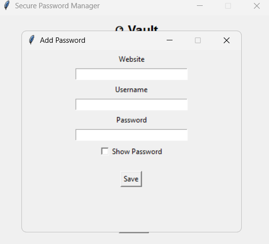
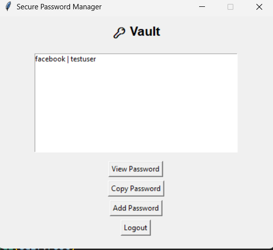

# 🔐 PasswordManager

A secure, lightweight **desktop password manager** built using **Python** and **Tkinter**, designed to safely store, retrieve, and manage login credentials using strong encryption.

---

## 📌 Overview

**PasswordManager** helps users securely store sensitive login credentials such as usernames and passwords for multiple online accounts. Instead of remembering numerous complex passwords, users can rely on a single **master password** to unlock an **encrypted vault**.

The application uses modern cryptographic techniques to ensure **confidentiality, integrity, and security** of stored data, while providing a clean and intuitive desktop user interface.

---

## ✨ Key Features

- 🔐 **Master Password Authentication**
- 🗄️ **Encrypted Password Vault (AES-256-GCM)**
- 🧠 **Strong Key Derivation (PBKDF2)**
- 👁️ **Show / Hide Password Toggle**
- 📋 **One-Click Copy to Clipboard**
- ⏱️ **Automatic Clipboard Clear**
- 🔍 **View Password on Demand**
- 🖥️ **User-Friendly Desktop UI (Tkinter)**
- ❌ No plaintext passwords stored on disk

---
### 🔐 Installation

Libraries used
cryptography
```text
pip install cryptography
```
Run ui
```text
python ui.py
```
## 🛡️ Security Design

- Passwords are **never stored in plaintext**
- Vault data is encrypted using **AES-256-GCM**
- Master password is **never saved**
- Encryption keys are derived using **PBKDF2**
- Vault is decrypted **only in memory**
- Clipboard data auto-clears after a fixed timeout

This design follows the same principles used by popular password managers like **KeePass**, **Bitwarden**, and **1Password**.

## 🖼️ Application Screenshots

### 🔐 Login Screen
Secure master password authentication to unlock the encrypted vault.


---

### ➕ Add New Password
Add website credentials with a secure password input and show/hide toggle.


---

### 🔑 Vault View
View saved accounts, securely retrieve passwords, or copy them with auto-clear clipboard protection.




---

## 🧰 Technology Stack

| Component | Technology |
|--------|-----------|
| Language | Python |
| UI | Tkinter |
| Cryptography | cryptography |
| Encryption | AES-256-GCM |
| Key Derivation | PBKDF2 |
| Storage | Encrypted local file |

---

## 📁 Project Structure

```text
PasswordManager/
│
├── password_manager.py   # Encryption and vault logic
├── ui.py                 # Tkinter user interface
├── vault.enc             # Encrypted password vault (auto-generated)
├── salt.bin              # Cryptographic salt (auto-generated)
└── README.md
